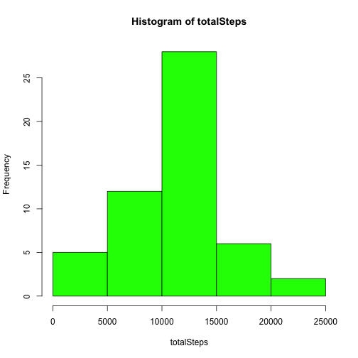
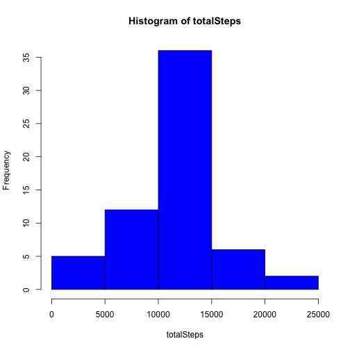

## Loading and preprocessing the data


```r
#Read the data file
data = read.csv("activity.csv")

#format the date column appropriately
data$date <- as.Date(data$date, format = "%Y-%m-%d") 

#check the structure to make sure data is properly loaded
str(data)
```

```
## 'data.frame':	17568 obs. of  3 variables:
##  $ steps   : int  NA NA NA NA NA NA NA NA NA NA ...
##  $ date    : Date, format: "2012-10-01" "2012-10-01" ...
##  $ interval: int  0 5 10 15 20 25 30 35 40 45 ...
```

```r
#summarize the data for information only
summary(data)
```

```
##      steps             date               interval     
##  Min.   :  0.00   Min.   :2012-10-01   Min.   :   0.0  
##  1st Qu.:  0.00   1st Qu.:2012-10-16   1st Qu.: 588.8  
##  Median :  0.00   Median :2012-10-31   Median :1177.5  
##  Mean   : 37.38   Mean   :2012-10-31   Mean   :1177.5  
##  3rd Qu.: 12.00   3rd Qu.:2012-11-15   3rd Qu.:1766.2  
##  Max.   :806.00   Max.   :2012-11-30   Max.   :2355.0  
##  NA's   :2304
```


## What is mean total number of steps taken per day?

First determine the total number of steps for each day (ignoring NA)

```r
totalSteps <- tapply(data$steps[!is.na(data$steps)], data$date[!is.na(data$steps)],sum)
hist(totalSteps, col="green")
```

 

The mean total number of steps taken per day is 

```r
mean(totalSteps,na.rm=TRUE)
```

```
## [1] 10766.19
```

The mean total number of steps taken per day is 

```r
median(totalSteps,na.rm=TRUE)
```

```
## [1] 10765
```


## What is the average daily activity pattern?

Let us construct a time series plot  of the 5-minute interval (x-axis) and the average number of steps taken, averaged across all days

```r
intervalMeans <- tapply(data$steps[!is.na(data$steps)], data$interval[!is.na(data$steps)],mean)
plot(unique(data$interval),intervalMeans,type="l",
     xlab="5 minute intervals", ylab="average number of steps taken",main="Average daily activity")
```

 

The 5 minute interval which has the highest average activity across all days is

```r
names(intervalMeans[intervalMeans==max(intervalMeans)])
```

```
## [1] "835"
```

The highest avearge activity on this interval was:

```r
max(intervalMeans)
```

```
## [1] 206.1698
```

## Imputing missing values

The total number of missing values in the dataset is 

```r
sum(is.na(data$steps))
```

```
## [1] 2304
```

We create a new dataset by copying the old dataset, and replacing missing values with mean of the respective 5 minute interval 

```r
newData <- data
for (i in 1:length(newData$steps)){
    if (is.na(newData$steps[i])){
        newData$steps[i] = intervalMeans[as.character(newData$interval[i])]
    } 
}
```

We calculate the total number of steps for each day as follows

```r
totalSteps <- tapply(newData$steps, newData$date,sum)
hist(totalSteps, col="blue")
```

 

The mean total number of steps taken per day is 

```r
mean(totalSteps)
```

```
## [1] 10766.19
```

The mean total number of steps taken per day is 

```r
median(totalSteps)
```

```
## [1] 10766.19
```

By imputing the missing values, naturally the total number of steps taken will increase however the average does not change as shown above. The reason for this is quite simple.
Consider how mean, $\mu$ is computed for $m$ numbers $(n_{1},n_{2},\ldots, n_{m})$
$$\mu = \frac{n_{1}+n_{2}+\ldots+ n_{m}}{m}$$
Now suppose we add a new number, $n_{m+1}$ which is equal to the average of $m$ numbers, $\mu$

therefore the new mean $\mu^{*}$ will be
$$\mu^{*} = \frac{n_{1}+n_{2}+\ldots+n_{m}+\mu}{m+1}$$
Note from our first expression 
$$\mu\times m = n_{1}+n_{2}+\ldots+ n_{m}$$
substituting this in the second expression yields
$$\mu^{*} = \frac{\mu\times m + \mu}{m+1}$$
$$\mu^{*} = \frac{\mu(m+1)}{m+1}$$
$$\mu^{*} = \mu$$


## Are there differences in activity patterns between weekdays and weekends?

From the trends, it is apparent that the person wakes up around 5am daily, and has a peak output in number of steps around 8am-9am (presumably daily gym workouts). 

Noticeably the person is more active at different intervals during the weekend compared to weekdays. This can be perhaps attributed to being stuck at a desk job during weekdays.


```r
day <- weekdays(newData$date)
day[day == "Sunday" | day == "Saturday"] <- "weekend"
day[!(day == "Sunday" | day == "Saturday" | day== "weekend")] <- "weekday"

newData$dayType  <- factor(day)

intervalMeans <- tapply(newData$steps, list( newData$interval, newData$dayType), mean)

par(mfrow = c(2,1))
with(newData,{
    plot(unique(interval),intervalMeans[,"weekday"],type="l",
         xlab="5 minute intervals", ylab="average number of steps taken", main="Weekday activity")
    
    plot(unique(newData$interval),intervalMeans[,"weekend"],type="l",
         xlab="5 minute intervals", ylab="average number of steps taken", main="Weekend activity") 
    
})
```

 
